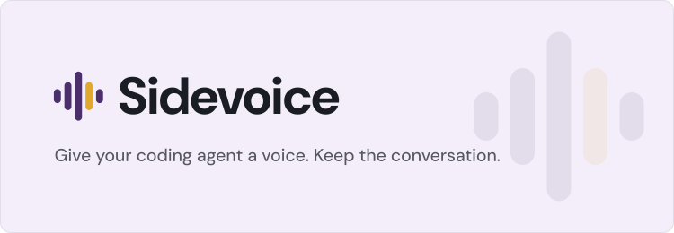

<!-- Header: .github/assets/readme-header*.svg, from the Sidevoice brand's banner. Badges: shieldcn
     (https://shieldcn.dev), each a light/dark pair so the row follows the reader's GitHub theme. -->
<picture>
  <source media="(prefers-color-scheme: dark)" srcset=".github/assets/readme-header-on-dark.svg" />
  
</picture>

<p>
  <a href="https://github.com/sidevoice/sidevoice-core/actions/workflows/release.yml"><picture><source media="(prefers-color-scheme: dark)" srcset="https://shieldcn.dev/github/ci/sidevoice/sidevoice-core.svg?variant=secondary&size=sm&workflow=release.yml&branch=main&mode=dark" /></picture></a>
  <a href="LICENSE"><picture><source media="(prefers-color-scheme: dark)" srcset="https://shieldcn.dev/github/license/sidevoice/sidevoice-core.svg?variant=secondary&size=sm&mode=dark" /></picture></a>
  <picture><source media="(prefers-color-scheme: dark)" srcset="https://shieldcn.dev/badge/status-beta.svg?variant=secondary&size=sm&mode=dark" /></picture>
</p>

# sidevoice-core

Reading your coding agent's plans, diffs and summaries all day is tiring. **Sidevoice** turns the conversation you
already have with your agent into a voice call. The agent keeps its context and keeps writing as usual; it also
speaks its replies, and you answer by voice and can interrupt it — from the sofa or on a walk, not only at your desk.

**sidevoice-core** is the part that runs on the machine where your agents run. It keeps that machine's
conversations, runs one voice pipeline per call (voice activity, end of turn, transcription, speech), and decides
which of your devices may use it.

## How it fits

| Piece | Role |
|---|---|
| [sidevoice-connector](https://github.com/sidevoice/sidevoice-connector) | What you install on that machine. It gives your agents their voice tools and installs, starts and supervises this core. |
| **sidevoice-core** (this repository) | The conversations and the voice pipeline, next to the agents. |
| [sidevoice-desktop](https://github.com/sidevoice/sidevoice-desktop) | The app you call from. |
| [sidevoice-web](https://github.com/sidevoice/sidevoice-web) | The call interface the app bundles; it can also be served as a static site. |

Your **machine** is the computer where your coding agents run; a **device** is what you call from (the desktop
app, a browser). A device talks to the core directly once it is paired with it. You do not normally install the core yourself: the
connector installs the version it was released with.

## Status

Beta. What works today:

- Voice calls with your agent's conversation from paired devices: you speak, your words reach the conversation as
  a message, and the agent's spoken replies come back.
- Turn detection with Silero VAD and smart-turn v3 (or a fixed silence), on onnxruntime: no PyTorch.
- Transcription and speech on the device (Whisper, Kokoro), or through OpenAI and ElevenLabs with your own key,
  which stays on this machine.
- Several devices in the same conversation, each with its own microphone and playback.
- One-time pairing codes, per-device tokens and immediate revocation.

Reaching your machine from outside your network needs a relay; that part is still being built.

## Build it from source

Rust 1.98, and libopus with `pkg-config` (`apt install libopus-dev pkg-config`, `brew install opus`). The voice
detectors' models are pinned by digest in `assets/rust-models.json`; `cargo xtask models` fetches, verifies and stages
them in `RUSTVANI_CACHE_DIR`, where the core and its tests read them:

```sh
export RUSTVANI_CACHE_DIR=~/.cache/sidevoice-models
cargo xtask models
cargo test --locked --all-features
cargo run --locked --release        # listens on 127.0.0.1:8768
```

`--help` lists its options. The connector starts it as `sidevoice-core-rust --data-dir D --port P`; `D/core.json`
(mode 0600) then says where it listens and which credential the connector links with. `cargo xtask dist` builds,
packages and verifies this machine's release archive, exactly as a release does ([`RELEASING.md`](RELEASING.md)).

Compatibility with the latest published connector and web client is `cargo xtask compat`, run weekly in CI.

## Configuration

Its data — provider keys, paired devices, the machine's identity key, the conversation journal — lives in
`SIDEVOICE_CORE_DATA_DIR`, else `~/.sidevoice/core`. Every secret file there is created with mode 0600.

| Variable | What it does |
|---|---|
| `VOICE_STT_API_KEY`, `VOICE_ELEVENLABS_API_KEY` | Provider keys for OpenAI transcription and ElevenLabs speech on a headless machine. A key saved from a paired device takes precedence. |
| `SIDEVOICE_PUBLIC_URLS` | Comma-separated addresses where devices can reach this machine directly; they go into pairing codes. Each must be `https://` (see Security). |
| `SIDEVOICE_TRUSTED_CLUSTER_HOSTS` | Hosts that may receive credentials over plain HTTP. Empty by default (see Security). |
| `SIDEVOICE_ALLOWED_HOSTS`, `SIDEVOICE_ALLOWED_ORIGINS` | Host names and page origins to answer besides loopback, for a machine you made reachable. |
| `SIDEVOICE_CORE_HOST`, `SIDEVOICE_CORE_PORT` | Where to listen (default `127.0.0.1:8768`). |

## Security

- **Devices.** Every route except discovery, the identity proof and redeeming a pairing code needs a device token.
  A device gets one by redeeming a one-time code (valid ten minutes); the core keeps only its hash, and revoking a
  device ends its open calls at once. Every paired device has the machine's full authority: there are no roles.
- **Discovery** (`GET /api/rendezvous`, `GET /api/device/identity`) answers without a token and says only what
  pairing needs: that this is a Sidevoice machine, its fingerprint and public key, and a signature over the
  caller's nonce. The machine's name is given only to a paired device.
- **Transport.** A pairing secret, device token or connector credential travels only over HTTPS, except to loopback
  and to the hosts in `SIDEVOICE_TRUSTED_CLUSTER_HOSTS`. An entry starting with a dot is a suffix
  (`.svc.cluster.local`); any other entry is one exact host. Listing a host there states that the network to it is
  yours (a Kubernetes cluster's pod network, say): whoever can read that network can read those credentials.
- **Relays are trusted.** A relay between a device and this machine terminates TLS on both sides: it sees the pairing
  secret redeemed through it, device tokens and all the traffic, including voice and any provider key saved from a
  device. The machine's signed identity proves which machine answered; it encrypts nothing. Use only a relay you
  trust, or reach the machine directly. End-to-end encryption to the machine's pinned identity is planned, not
  there yet.

Please report vulnerabilities privately through
[GitHub's security advisories](https://github.com/sidevoice/sidevoice-core/security/advisories/new), not in an issue.

## Layout

```
rust/              the core: one crate, the binary sidevoice-core-rust
  runtime/         process configuration, launch handshake, listeners, shutdown
  server/          the device and connector surfaces (HTTP, WebSocket, Socket.IO, WebRTC) and the calls they carry
  control/         conversations, devices and pairing, latency, telemetry
  pipeline/        voice activity and end of turn, behind Rustvani
  providers/       the OpenAI and ElevenLabs adapters and the synthesis cache
  models/          settings, the models a device reports, and model-check rules
  messages/        the per-language message bundles
  storage/         private files and process locks
tests/             integration tests, with their recorded voice and provider responses
xtask/             build tooling: models, release archives, manifest, compatibility (`cargo xtask`)
assets/catalog/    the remote-provider and speech-language catalogues, and model-check clips
```

## Contributing

Issues and pull requests are welcome. Read [`AGENTS.md`](AGENTS.md) first: it holds the rules for code, texts and
tests, for people and coding agents alike. Pull request titles follow
[Conventional Commits](https://www.conventionalcommits.org) (CI checks them) and become the squashed commit, from
which release notes are written ([`RELEASING.md`](RELEASING.md)).

## Licence

[Apache-2.0](LICENSE). The Sidevoice name and logo are trademarks: forks are welcome under their own name — see
[`TRADEMARKS.md`](TRADEMARKS.md).
